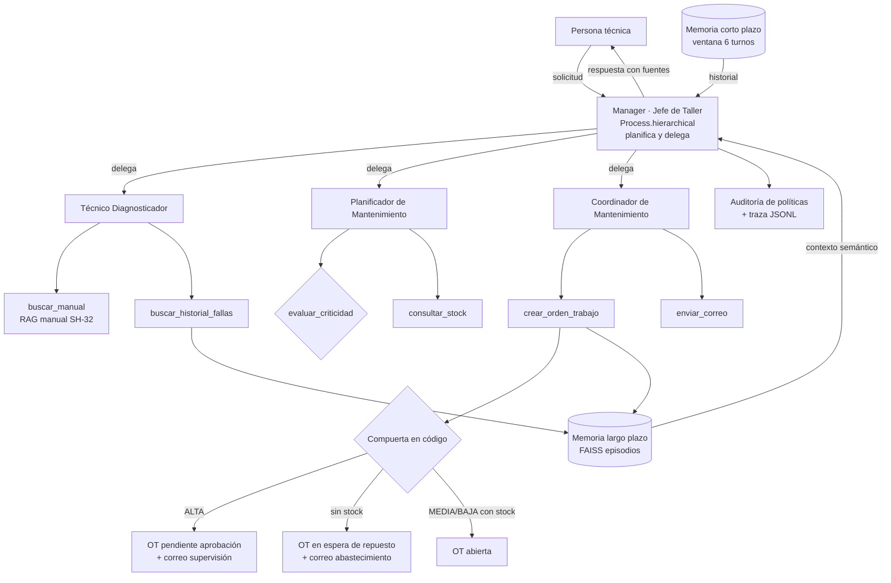

```mermaid
flowchart TD
    U[Persona técnica] -->|solicitud| M[Manager · Jefe de Taller<br/>Process.hierarchical<br/>planifica y delega]
    CP[(Memoria corto plazo<br/>ventana 6 turnos)] -->|historial| M
    LP[(Memoria largo plazo<br/>FAISS episodios)] -->|contexto semántico| M
    M -->|delega| D[Técnico Diagnosticador]
    M -->|delega| P[Planificador de Mantenimiento]
    M -->|delega| C[Coordinador de Mantenimiento]
    D --> T1[buscar_manual<br/>RAG manual SH-32]
    D --> T2[buscar_historial_fallas]
    P --> T3{evaluar_criticidad}
    P --> T4[consultar_stock]
    C --> T5[crear_orden_trabajo]
    C --> T6[enviar_correo]
    T5 --> G{Compuerta en código}
    G -->|ALTA| PA[OT pendiente aprobación<br/>+ correo supervisión]
    G -->|sin stock| ES[OT en espera de repuesto<br/>+ correo abastecimiento]
    G -->|MEDIA/BAJA con stock| AB[OT abierta]
    T5 --> LP
    T2 --> LP
    M --> AU[Auditoría de políticas<br/>+ traza JSONL]
    M -->|respuesta con fuentes| U
```